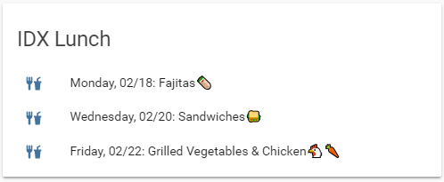

# Home Assistant Lovelace List Item Card



## Purpose

This is a pretty niche use case. This card takes sensor attributes that are lists of strings and displays them as a card. Each item in the list it displayed on a line with an optional icon as a bullet point.

## Installation

Copy `list-item-card.js` to where-ever you keep your custom lovelace cards. Mine are kept in `custom-lovelace/`

```yaml
- url: /local/custom-lovelace/list-item-card/list-item-card.js
  type: js
```

Then add into your lovelace views

```yaml
- type: custom:list-item-card
  entity: sensor.my_sensor
  attribute: dataList
```

## Options

### entity
_(String) (Required)_ The entity containing the list attribute.

### attribute
_(String) (Required)_ The attribute that is a list of string.

### title
_(String) (Optional)_ The card's title.

### icon
_(String) (Optional)_ The icon to prefix each list item. The area will be empty if this is omitted.

### max_length
_(Int) (Optional)_ The maximum number of items that will be read from the list. Defaults to 4.